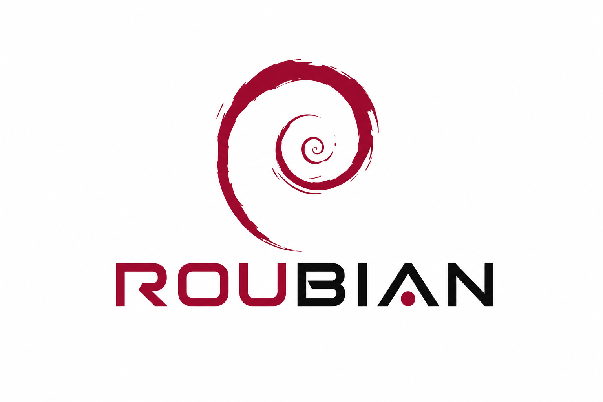

# 🐧 Roubian v0.19



**Roubian** es mi configuración personal basada en **Debian 13 (Trixie)** con **i3wm**, creada con la idea de tener un entorno de trabajo cómodo, ligero, productivo y visualmente atractivo.

No es una distribución oficial ni un sistema independiente, sino un conjunto de configuraciones, scripts, temas y ajustes personales para transformar una instalación de Debian en un entorno enfocado en **programación, productividad y uso diario**.

---

# ✨ Filosofía

La idea detrás de Roubian es simple:

> Un entorno de trabajo debe ser rápido, bonito y cómodo de usar.

Busco combinar:

* ⚡ Rendimiento y bajo consumo de recursos.
* 🖥️ Una interfaz limpia y minimalista.
* 🎨 Un diseño moderno y agradable visualmente.
* 🧑‍💻 Un entorno preparado para programar.
* 🚀 Herramientas que mejoren la productividad.

Roubian nace como una configuración hecha para mi propio uso, adaptada a mis gustos y necesidades. Lo subo a GitHub principalmente para tener un respaldo, llevar un historial de cambios y compartir el proyecto con otras personas.

Si alguien quiere usarlo, modificarlo o tomar partes de la configuración, es totalmente libre de hacerlo.

---

# 🖥️ Sistema base

* **Distribución:** Debian 13 (Trixie)
* **Window Manager:** i3wm
* **Terminal:** Kitty
* **Shell:** Zsh
* **Barra de estado:** Polybar
* **Launcher:** Rofi
* **Compositor:** Picom

---

# 🛠️ Incluye

## i3wm

Configuración personalizada del gestor de ventanas:

* Atajos personalizados.
* Organización de escritorios.
* Integración con Polybar.
* Inicio automático de aplicaciones.

## Kitty

Terminal configurada para programación:

* JetBrains Mono Nerd Font.
* Tema oscuro.
* Ajustes visuales personalizados.

## Polybar

Barra de estado con:

* Workspaces.
* Información del sistema.
* Reproductor multimedia.
* Scripts personalizados.

## Rofi

Launcher personalizado con temas:

* Menú de aplicaciones.
* Estilos oscuros.
* Diseños personalizados.

## Picom

Efectos visuales:

* Transparencias.
* Sombras.
* Mejor experiencia visual.

## Zsh

Configuración personalizada de shell:

* Alias.
* Mejor experiencia en terminal.
* Flujo de trabajo más cómodo.

---

# 📂 Estructura

```
roubian/
├── .config/
│   ├── i3/
│   ├── kitty/
│   ├── picom/
│   ├── polybar/
│   └── rofi/
│
├── wallpapers/
├── fonts.md
├── packages.txt
├── install.sh
├── README.md
└── .zshrc
```

---

# 🚀 Instalación

Clona el repositorio:

```bash
git clone https://github.com/Roussel19/roubian.git
```

Entra a la carpeta:

```bash
cd roubian
```

Dale permisos al instalador:

```bash
chmod +x install.sh
```

Ejecuta:

```bash
./install.sh
```

Después reinicia i3:

```
Mod + Shift + R
```

---

# 🔤 Fuentes

Roubian utiliza principalmente:

* JetBrains Mono Nerd Font
* Symbols incluidos en Nerd Fonts

Más información:

```
fonts.md
```

---

# 📦 Paquetes recomendados

Los paquetes necesarios están documentados en:

```
packages.txt
```

Incluye herramientas utilizadas por la configuración como:

* i3wm
* Kitty
* Polybar
* Rofi
* Picom
* Zsh
* Playerctl
* Brightnessctl

---

# 🔄 Desarrollo

Roubian seguirá evolucionando con el tiempo.

Iré agregando mejoras, nuevos temas, ajustes y herramientas conforme vaya personalizando mi entorno.

Algunas futuras mejoras pueden incluir:

* Más automatización.
* Mejor instalador.
* Nuevos temas.
* Más scripts.
* Mejor documentación.

---

# 📸 Capturas

*(Próximamente)*

---

# 📜 Licencia

Roubian es un proyecto personal, pero está disponible para que otras personas puedan usarlo, modificarlo y adaptarlo a sus propias necesidades.

Si algo de esta configuración te sirve, úsalo libremente.

---

# 👤 Autor

Creado por **Roussel19**.

Proyecto personal desarrollado para crear un entorno Linux cómodo, productivo y visualmente hermoso.
